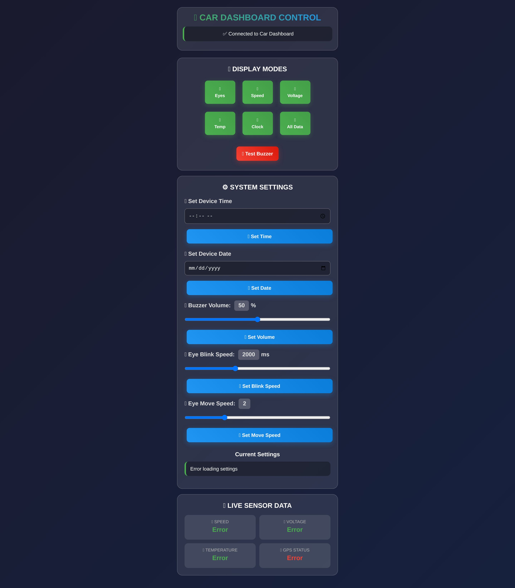
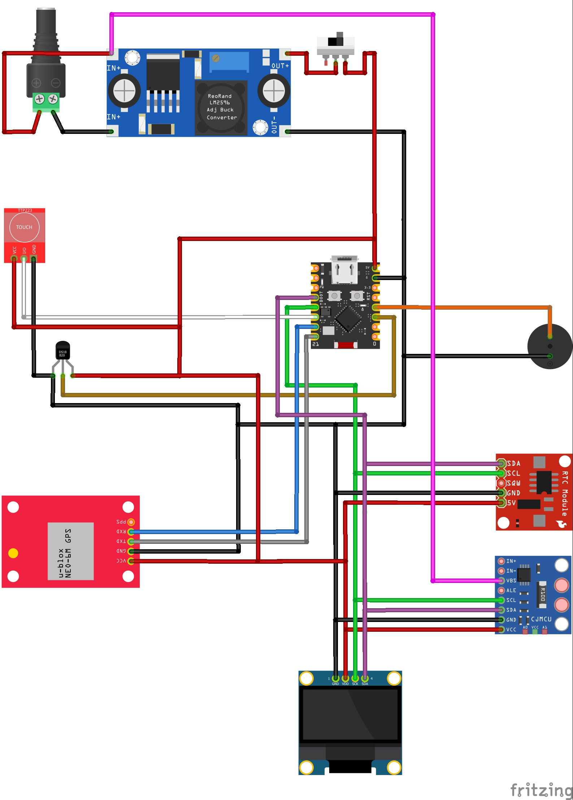
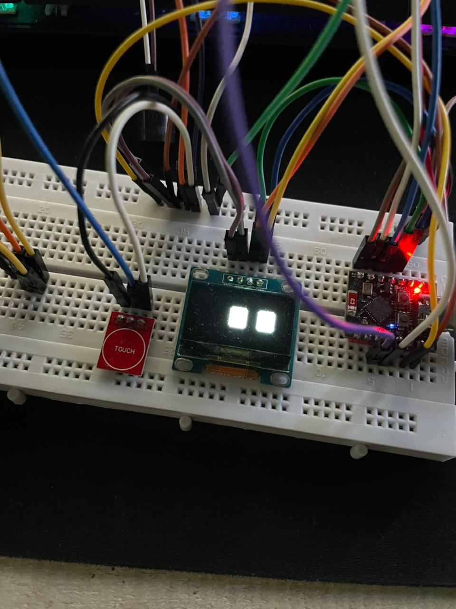

# 🚗🛵 Advanced Vehicle Dashboard System with ESP32-C3

*Real-time vehicle monitoring system with web interface control*

[Features](#-features) • [Hardware](#-hardware-requirements) • [Installation](#-installation) • [Usage](#-usage) • [Gallery](#-project-demo)

## 📋 Overview

Advanced car dashboard system built with ESP32-C3 that provides real-time monitoring of vehicle parameters including speed, battery voltage, temperature, and GPS data. Features a responsive web interface for remote control and configuration.

## ✨ Features

### 📊 Sensor Monitoring
- **🚀 Real-time GPS Speed** - Accurate speed tracking with GPS module
- **🔋 Battery Voltage** - Continuous voltage monitoring with INA226
- **🌡️ Temperature Sensing** - DS18B20 temperature sensor support
- **🛰️ GPS Status** - Satellite connection status and coordinates

### 🖥️ Display Modes
- **👀 Animated Eyes** - Interactive eye animations with customizable blink speed
- **🚀 Speed Display** - Large segment-style speed readout
- **📊 Statistics** - Max/Min/Average values for all sensors
- **⏰ Digital Clock** - RTC-based time with date display
- **📈 All Sensors** - Comprehensive data overview

### 🌐 Web Interface
- **📱 Responsive Design** - Works on desktop and mobile devices
- **🔧 Real-time Control** - Change display modes remotely
- **⚙️ Settings Management** - Configure buzzer volume, animation speeds
- **📅 Time/Date Setup** - Synchronize RTC via web interface
- **🔊 Buzzer Test** - Remote buzzer control

## 📸 Project Demo

### Web Interface

### Hardware Setup  

### Display in Action

**✨ Pro Tip:** *You can replace these placeholder images with your actual project photos by adding files to the `images/` folder!*

## 🛠 Hardware Requirements

### Main Components
- **ESP32-C3** Development Board
- **GPS Module** (NEO-6M or similar)
- **OLED Display** (SSD1306, 128x64)
- **Temperature Sensor** (DS18B20)
- **Voltage Sensor** (INA226)
- **RTC Module** (DS1307)
- **Buzzer** and **Touch Sensor**

## 🔌 Pin Connections

| Component | ESP32-C3 Pin |
|-----------|--------------|
| OLED/rtc SDA | GPIO8 |
| OLED/rtc SCL | GPIO9 |
| GPS RX | GPIO20 |
| GPS TX | GPIO21 |
| Temperature | GPIO2 |
| Touch Sensor | GPIO10 |
| Buzzer | GPIO3 |

## 🚀 Quick Start

1. **Upload Code** to ESP32-C3
2. **Connect to WiFi**: "Dashboard_Car" (password: 12345678)
3. **Open Browser** to: `http://192.168.4.1`
4. **Start Monitoring** your vehicle data!

## 📦 Installation

[See full installation guide in the docs folder](docs/wiring_connection.md)

## 🔧 Configuration

Modify settings in the web interface:
- **Buzzer Volume**: 0-100%
- **Blink Speed**: 500-5000ms  
- **Eye Movement**: Speed 1-5
- **Time/Date**: Sync with RTC

## 📞 Support

Having issues? Check the [troubleshooting guide](docs/troubleshooting.md) or create an issue in this repository.

---

**Built with ❤️ using ESP32-C3 and Arduino**

⭐ **If you like this project, don't forget to give it a star!**

